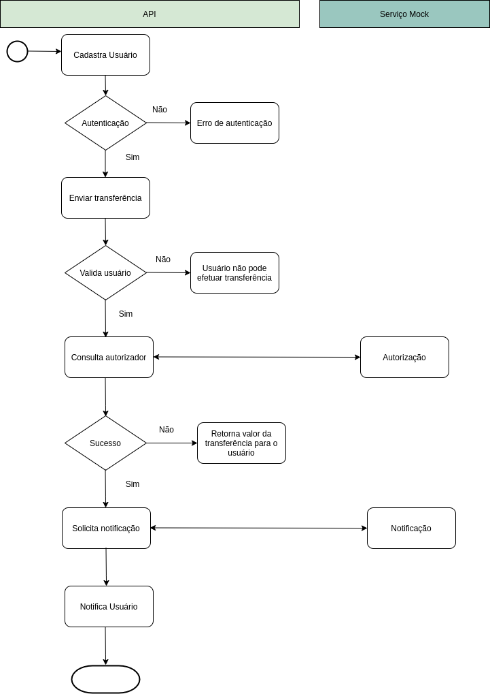

# Desafio PicPay

Este projeto baseado em [Docker](https://www.docker.com/) e, por isso, é necessário o ter instalado para execução do ambiente.

A pasta `./bin` possui diversos scripts utilitários, para configuração, execução e manipulação do ambiente de desenvolvimento da aplicação.

Para configurar e acessar o projeto, execute:

## Configurando o projeto

```
./bin/config
```
Faz a cópia dos arquivos de configuração.

```
Obs: Executar apenas uma vez, inserir dados de conexão em .env.
```

```
./bin/run
```
Inicia os containers Docker.

```
./bin/composer install
```
Instala as dependências da aplicação.

```
./bin/artisan migrate:fresh --seed
```
Instala as migrações e seeders.


### Outros Comandos

```
./bin/tests
```
Excuta os testes da aplicação

```
./bin/workspace
```
Entra no container da aplicação

```
./bin/mysql
```
Entra no container MySql da aplicação

### Diagrama

<p align="center"></p>
