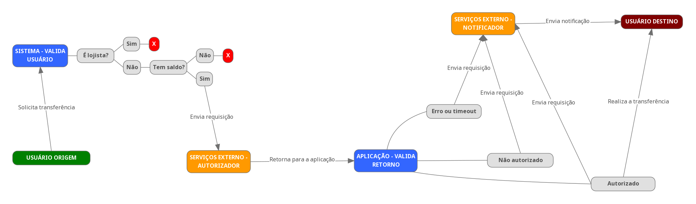

# Desafio PP

- Execute as dependências
```
docker run --rm -v $(pwd):/app composer install
```

- Criei o arquivo .env
```
cp .env.example .env
```

- Inicie os containers
```
docker-compose up -d
```

- Gere a chave da aplicação
```
docker-compose exec app php artisan key:generate
```

- Coloque as configurações em cache
```
docker-compose exec app php artisan config:cache
```

- Crie as tabelas
```
docker-compose exec app php artisan migrate
```

- Acesse o link
```
http://127.0.0.1:81
```

## Fluxo de transferência

